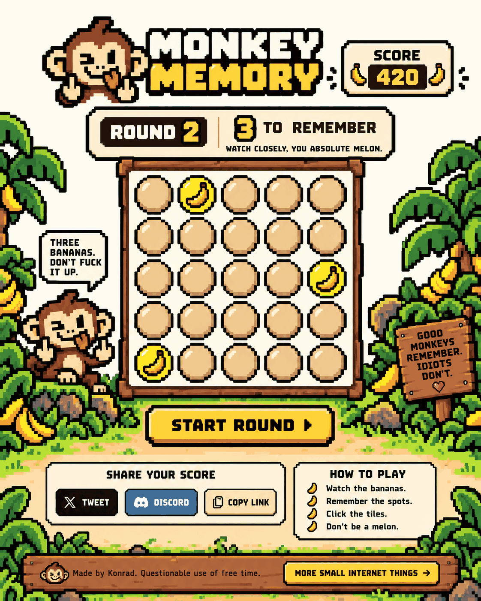

# Monkey Memory

A rude little pixel-art memory game.

Watch the bananas. Remember the spots. Post your score. Fail like an idiot.

## [▶ PLAY HERE](https://konradbuilds.github.io/monkey-memory/)

No framework. No backend. Just one lean HTML game, some pixel art, and a deeply unhelpful monkey.

### How it works

- 5 × 5 board.
- A few tiles reveal bananas.
- Remember the spots.
- Click the right tiles.
- Score goes up. Confidence goes up. Then you die.
- Best score is stored locally.
- Native share where supported, copy fallback everywhere else.

### Files

- `index.html` — the game
- `assets/monkey-face.png` — favicon / logo monkey
- `assets/banana.png` — banana tile icon
- `screenshot.png` — README screenshot
- `monkey-memory-share.png` — social sharing image

### Version

**2.0**

### Author

[Konrad](https://konradbuilds.github.io/)

### License

GNU General Public License v3.0. See [LICENSE](./LICENSE).
